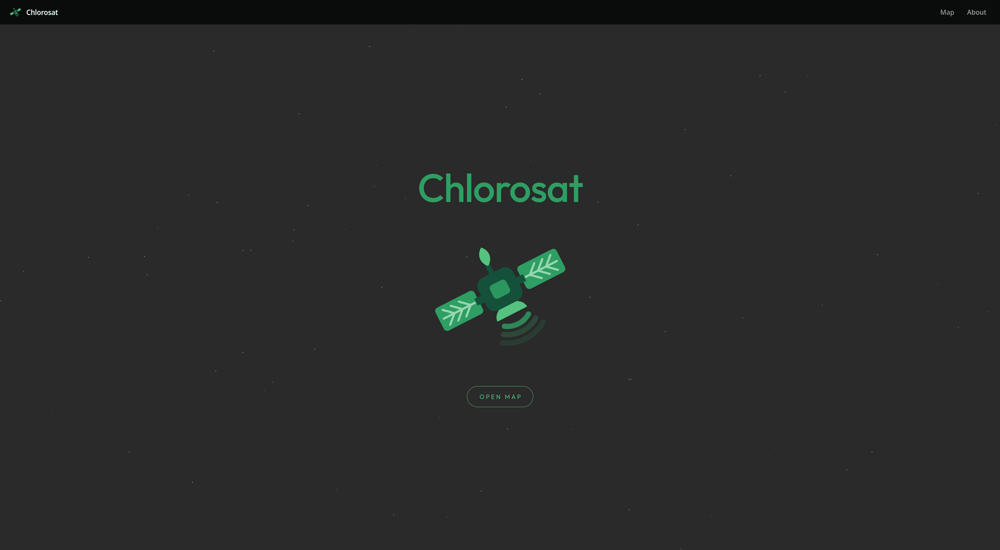
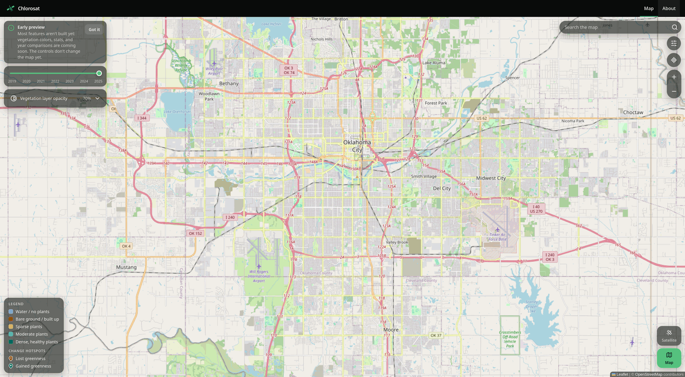

# Chlorosat: Vegetation Monitoring (CS3203)

Chlorosat shows **how green the Oklahoma City area is, and how that's changing**, using satellite data drawn over a normal map. It's built for people who aren't map experts: policymakers, environmental activists and scientists, and homebuyers.

**Live site:** [chlorosat.com](https://chlorosat.com) · **Tasks:** [docs/BACKLOG.md](docs/BACKLOG.md) · **Team:** Group E, CS3203-001

## Table of Contents

- [What it does](#what-it-does)
- [Screenshots](#screenshots)
- [Status](#status)
- [How it works](#how-it-works)
- [Tech Stack](#tech-stack)
- [Setup](#setup)
- [Project Structure](#project-structure)
- [Docs](#docs)
- [Contributing](#contributing)
- [Branching Strategy](#branching-strategy)
- [Commit Messages](#commit-messages)
- [CI/CD](#cicd)
- [Team](#team)

## What it does

Region: Oklahoma City and surroundings (Yukon to Choctaw, Edmond to Norman). More regions can be added by config.

- Shows vegetation as a colored layer over an interactive map (street or satellite base map).
- Detects vegetation two ways:
  - **Infrared (NDVI):** plant *health*, from near-infrared light.
  - **Visible light:** areas that *look green* in a normal photo.
- By default shows a **recommended view** that uses both together. Single-method views are available in View settings, with a warning that they're less accurate on their own.
- Compares years (2019 to 2025 planned), marks change hotspots, and shows simple stats in plain language.

Why two methods, and who it's for: [docs/PRINCIPLES.md](docs/PRINCIPLES.md).

## Screenshots

| Home page (`/`) | Map page (`/map/`) |
|---|---|
|  |  |

## Status

Early development (end of Sprint 2). **Working now** (live on [chlorosat.com](https://chlorosat.com)):

- **Home page** with an **Open map** button. The map page loads only when asked, so the first page stays light.
- **Map page:** Leaflet map locked to the region, with the control layout: search bar, year slider, vegetation opacity, View settings, legend, zoom, Satellite/Map buttons. Most controls **don't change the map yet** (they wait for the data layers).
- **Auto-deploy:** every merge to `main` goes live within minutes.

**Not yet:** real vegetation overlays, satellite tiles, stats, compare mode, About page content. Who's doing what, and when: [docs/BACKLOG.md](docs/BACKLOG.md).

## How it works

```
pipeline/ (Python, on laptops)  →  web/public/data/ (PNGs + JSON, committed)  →  web/ (static Next.js site)  →  nginx on the VPS
```

- The **pipeline** downloads satellite bands, computes vegetation per method, and writes colored PNG overlays + stats JSON.
- The **website** is a static export: plain HTML/JS/CSS, no backend server. It reads `manifest.json` to know which regions, methods, and years exist.
- The two sides only talk through the **data contract** in [docs/ARCHITECTURE.md](docs/ARCHITECTURE.md#data-contract).

## Tech Stack

**Frontend:** Next.js (static export), React, JavaScript, CSS Modules

- Map: Leaflet + react-leaflet
- Vegetation drawn as PNG image overlays (not heatmaps; decision D2 in ARCHITECTURE)

**Pipeline:** Python 3.12, managed with [uv](https://docs.astral.sh/uv/)

- Parses satellite imagery (source: decision D7) into PNG overlays + stats JSON

**Hosting:** nginx serving static files on a small VPS, behind Cloudflare. GitHub Actions deploys it (server side: Adam only).

## Setup

Needs **Git**, **Node.js 22**, and **uv**. Install links, OS notes, and common problems: [docs/SETUP.md](docs/SETUP.md).

```bash
git clone https://github.com/adamweaver/Chlorosat.git
cd Chlorosat
```

**Website** (from the repo root):
```bash
cd web
npm ci             # install exact package versions
npm run dev        # http://localhost:3000 (home) and http://localhost:3000/map/ (map)
npm run lint       # check code style
npm run build      # static site -> web/out/ (what gets deployed)
```

**Pipeline** (from the repo root):
```bash
cd pipeline
uv sync                  # install Python + packages
uv run pytest            # tests (right now: 4 passed, 10 skipped until the pipeline is written)
uv run ruff check        # check code style
uv run chlorosat --help  # the command-line tool
```

## Project Structure

| Path | What |
|---|---|
| `pipeline/` | Python pipeline. `regions.toml` = region list; `src/chlorosat/` = the code (`methods.py` = detection methods + class colors); `tests/`. Raw downloads go to `pipeline/data/` (never committed). |
| `web/src/app/` | Pages: `page.js` = home (`/`), `map/page.js` = map (`/map/`), `about/` (`/about/`), plus `layout.js` (header around every page). |
| `web/src/components/` | UI. `MapApp` holds map state → `MapView` draws the map layers, `MapOverlay` lays out the controls (one component per control). `Satellite` + `Stars` = home page art. |
| `web/src/css/` | `globals.css` (design tokens, shared `.glass` / `.range`) + one CSS Module per component or page. |
| `web/src/fonts/` | Outfit font for the home page + its license (`OFL.txt`). |
| `web/src/lib/data.js` | Loads `manifest.json` and stats files. |
| `web/public/` | Copied into the site as-is: `data/` (pipeline output the site reads, committed), `robots.txt`. |
| `deploy/` | Manual deploy script + nginx config (server side: Adam only). |
| `.github/` | GitHub Actions: `ci.yml` (checks every PR), `deploy.yml` (deploys every merge); PR + issue templates. |
| `docs/` | Principles, architecture, backlog, setup, deployment, `research/`, `scrum/` (sprint plans). |
| `branding/` | Logo + color palette. |
| `AGENTS.md`, `CLAUDE.md` | Rules for AI coding tools. |
| `WHATS_NEW.md` | Temporary catch-up notes for the team. |

## Docs

- [PRINCIPLES.md](docs/PRINCIPLES.md): goals, audiences, design rules
- [ARCHITECTURE.md](docs/ARCHITECTURE.md): how it fits together, data contract, decision log
- [BACKLOG.md](docs/BACKLOG.md): every task, its owner, and its acceptance criteria
- [SETUP.md](docs/SETUP.md): developer setup + common problems
- [DEPLOYMENT.md](docs/DEPLOYMENT.md): how the site gets to the VPS, and the security rules
- [docs/scrum/](docs/scrum/): sprint plans
- [AGENTS.md](AGENTS.md): rules for AI tools (AI-written code is tagged `[AI]`)

## Contributing

1. **Pick a task** in [docs/BACKLOG.md](docs/BACKLOG.md) (your sprint's tasks are in [docs/scrum/](docs/scrum/)) and move its row to **In Progress**. Its "Done when" column says when it's finished.
2. **Branch** off an up-to-date `main`: `git switch main && git pull && git switch -c feature/<name>`.
3. **Code + commit** in small steps. Before pushing, run the checks from [Setup](#setup) for the part you changed (`npm run lint` + `npm run build`, or `uv run pytest` + `uv run ruff check`).
4. **Open a PR** into `main`. The template asks what changed, how to test it, and whether AI helped. Request a review.
5. **Merge** when CI passes and 1 teammate approves. The site deploys automatically. Delete the branch and move the backlog row to **Done** with the PR number.

Changing the data contract, the architecture, or adding a dependency? Ask the team first ([ARCHITECTURE.md](docs/ARCHITECTURE.md#data-contract)).
Using AI? Tag AI-written code with the `[AI]` comment block from [AGENTS.md](AGENTS.md).

**This repo is public.** Never commit passwords, tokens, keys, `.env` files, or server addresses (use placeholders like `<host>`). Rules: [AGENTS.md → Security & secrets](AGENTS.md#security--secrets) and [DEPLOYMENT.md → Security](docs/DEPLOYMENT.md#security).

## Branching Strategy

`main` is protected: a PR with 1 approval and passing CI is required, and direct or force pushes are blocked. Delete branches after merging.

- `main` — production branch. Every merge goes live on chlorosat.com.
- `feature/<name>` — one branch per feature (e.g. `feature/ndvi-calculation`)
- `bugfix/<name>` — one branch per bug fix (e.g. `bugfix/<bug>`)
- If branching off a branch, branch from the feature branch (not `main`), then merge back into it when done.

## Commit Messages

Keep them short and straightforward (e.g. `Add NDVI calculation endpoint`, not `added stuff`).

## CI/CD

- **CI:** every PR and push to `main` runs pipeline lint + tests and web lint + build via GitHub Actions ([ci.yml](.github/workflows/ci.yml)). CI must pass before merging.
- **CD:** every merge to `main` builds the site and uploads `web/out/` to the VPS ([deploy.yml](.github/workflows/deploy.yml)), using a deploy key that can only write the site's folder. Details: [docs/DEPLOYMENT.md](docs/DEPLOYMENT.md).

## Team

Group E — CS3203-001 Software Engineering: Adam, Carter, David, Kevin, Lucas. Current tasks per person: [docs/BACKLOG.md → Who's doing what](docs/BACKLOG.md#whos-doing-what).
